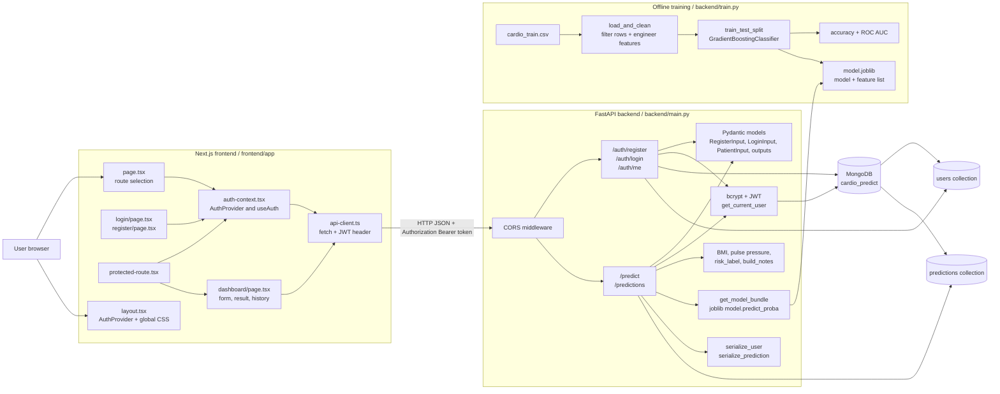
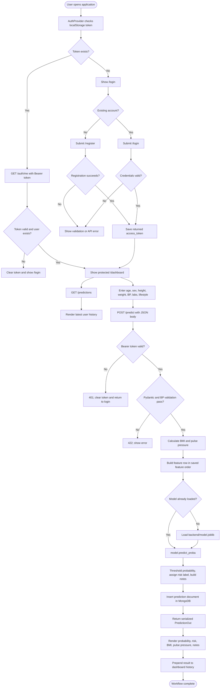
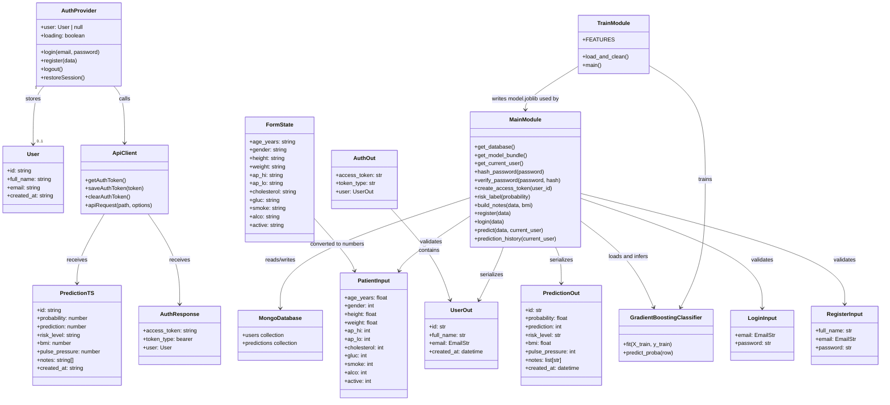

# CardioPredict Diagram Specification

This document describes the current CardioPredict implementation so another AI can create accurate documentation diagrams. The diagrams below are based on the source code, not on an imagined generic architecture.

## Project Summary

CardioPredict is a full-stack cardiovascular risk screening application.

- The frontend is a Next.js 16 and React 19 application written in TypeScript.
- The backend is a FastAPI application written in Python.
- MongoDB stores users and authenticated users' prediction history.
- Passwords are hashed with bcrypt.
- Sessions use JWT bearer tokens stored by the browser in `localStorage`.
- A scikit-learn `GradientBoostingClassifier` is trained offline by `backend/train.py` and saved as `backend/model.joblib`.
- The API lazily loads the saved model on the first prediction request.
- The prediction endpoint calculates BMI and pulse pressure, calls the model, assigns a risk label, creates explanatory notes, and stores the result.

Important scope: this is a screening estimate, not a medical diagnosis. The UI communicates that limitation to users.

## Source Map

| Area | Source | Responsibility |
|---|---|---|
| Frontend entry | `frontend/app/page.tsx` | Restores auth state and redirects to `/dashboard` or `/login` |
| Frontend auth state | `frontend/app/auth-context.tsx` | Stores the current user, restores `/auth/me`, logs in, registers, and logs out |
| Frontend HTTP client | `frontend/app/api-client.ts` | Adds the JWT bearer header, sends JSON, handles API errors, and clears invalid tokens |
| Login UI | `frontend/app/login/page.tsx` | Sends credentials through `useAuth().login` |
| Registration UI | `frontend/app/register/page.tsx` | Validates password confirmation and sends registration data |
| Route protection | `frontend/app/components/protected-route.tsx` | Redirects unauthenticated users away from protected pages |
| Dashboard | `frontend/app/dashboard/page.tsx` | Collects patient values, requests predictions, shows results, and loads history |
| API and domain logic | `backend/main.py` | Auth, JWT validation, request validation, model inference, notes, persistence, and API serialization |
| Model training | `backend/train.py` | Cleans CSV data, engineers features, trains and evaluates the model, and writes `model.joblib` |
| Database | MongoDB | `users` and `predictions` collections |

## Diagram 7: System Architecture / Program Modules

Use this as the architecture diagram. It shows the deployed/runtime modules and the offline training module separately.



### Architecture relationships to preserve

1. The browser never talks directly to MongoDB or the model file.
2. `api-client.ts` is the shared frontend boundary for all backend requests.
3. `AuthProvider` owns browser session state; the backend remains the authority for token validity and user existence.
4. `get_current_user` protects `/auth/me`, `/predict`, and `/predictions`.
5. The training pipeline is not called by the web request. It produces `model.joblib` ahead of time.
6. The prediction response contains derived values and notes, while the stored prediction document also keeps the submitted input.

## Diagram 8: System Flowchart

Use this for the primary user workflow. It includes the startup/session decision, authentication, prediction validation, inference, persistence, and history retrieval.



### Exact prediction behavior

The `PatientInput` request must satisfy these ranges:

- `age_years`: 18 to 100
- `gender`: 1 or 2
- `height`: 120 to 220 cm
- `weight`: 30 to 200 kg
- `ap_hi`: 80 to 250
- `ap_lo`: 40 to 180
- `cholesterol` and `gluc`: 1 to 3
- `smoke`, `alco`, and `active`: 0 or 1

The endpoint also rejects `ap_hi <= ap_lo`. It computes:

- `bmi = weight / (height / 100) ** 2`
- `pulse_pressure = ap_hi - ap_lo`

The model receives these 13 features in the exact order saved by `train.py`:

```text
age_years, gender, height, weight, bmi, ap_hi, ap_lo,
pulse_pressure, cholesterol, gluc, smoke, alco, active
```

Risk labels are assigned from the probability:

| Probability | Label |
|---|---|
| `< 0.30` | Low |
| `0.30` to `< 0.55` | Moderate |
| `0.55` to `< 0.75` | Elevated |
| `>= 0.75` | High |

The binary `prediction` is `1` when probability is at least `0.5`; otherwise it is `0`.

## Diagram 9: Object / Class Diagram

The application uses a small number of explicit classes. Most backend behavior is implemented as module-level functions in `main.py`, so the diagram should show both the Pydantic data models and the service functions rather than inventing controller classes.



### Object/class interpretation

- `RegisterInput`, `LoginInput`, `PatientInput`, `UserOut`, `AuthOut`, and `PredictionOut` are Python Pydantic models. They validate request data and define API response schemas.
- `User`, `AuthResponse`, `FormState`, and `PredictionTS` are TypeScript types used only at compile time in the frontend.
- `AuthProvider` is the main frontend runtime object: a React context provider containing auth state and operations.
- `ApiClient` represents the exported functions in `api-client.ts`; it is a module, not a class declaration.
- `MainModule` represents the service functions in `backend/main.py`; FastAPI route functions are module-level functions rather than methods of a controller class.
- `TrainModule` represents the offline script in `backend/train.py`.
- `MongoDatabase` and its collections are external persistence objects managed through PyMongo.

## Data Storage Model

### `users`

Each user document contains `_id`, `full_name`, normalized lowercase `email`, `password_hash`, `created_at`, and `updated_at`. A unique index is created on `email`.

### `predictions`

Each prediction document contains `user_id`, the original validated `input`, a nested `result` object, and `created_at`. An index supports lookup by `user_id` and descending `created_at`. The history endpoint returns at most the 50 newest records for the authenticated user, and the dashboard displays at most 8 at once.

## Runtime Prerequisites and Known Startup Conditions

The documented local startup sequence is:

1. Install Python dependencies from `backend/requirements.txt` in an activated virtual environment.
2. Configure `backend/.env` from `.env.example`.
3. Ensure MongoDB is running or use a MongoDB Atlas URI.
4. Ensure `backend/model.joblib` exists; run `python train.py` if it does not.
5. Start the backend from `backend/` with `uvicorn main:app --reload --port 8000`.
6. Install frontend dependencies with `npm install`.
7. Set `NEXT_PUBLIC_API_URL=http://localhost:8000` in `frontend/.env.local` if a non-default API URL is needed.
8. Start the frontend from `frontend/` with `npm run dev`.

The recorded commands exited with code 1, but no error output is included in the project context. Do not assert a single cause without the terminal error text. The first checks should be: whether Python dependencies are installed in the selected environment, whether Node dependencies are installed, whether MongoDB is reachable, whether `backend/.env` exists, and whether `model.joblib` is present.

## Instructions for the Diagram-Generating AI

Create three polished diagrams using the specifications in this file:

1. **Diagram 7 - System Architecture / Program Modules:** show browser, Next.js modules, FastAPI routes and services, MongoDB collections, and the offline model-training pipeline.
2. **Diagram 8 - System Flowchart:** show session restoration, registration/login, protected dashboard access, validation, feature engineering, model inference, persistence, and result rendering.
3. **Diagram 9 - Object/Class Diagram:** show the explicit TypeScript types, Pydantic models, frontend auth/client modules, backend service functions, model artifact, classifier, and MongoDB persistence. Clearly label module representations so they are not mistaken for literal classes.

Do not add services that are absent from this codebase, such as Redis, a separate authentication service, a separate model service, a frontend API proxy, background workers, or a relational database.